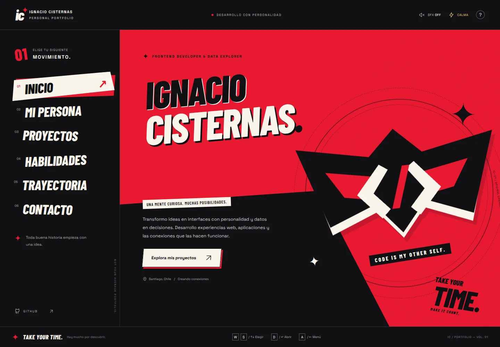

# Ignacio Cisternas · Personal Portfolio

**Take your time. Make it count.**

Portafolio interactivo en español, inspirado en el lenguaje visual de los menús de **Persona 5 Royal**: recortes diagonales, tipografía expresiva, rojo/negro/blanco y navegación por teclado. Construido con React, TypeScript y Vite.



[Ver la versión móvil](docs/preview-mobile.webp)

## Qué incluye

- **Inicio:** identidad visual propia y una máscara original que combina símbolos de código.
- **Mi persona:** perfil, formación e intereses profesionales.
- **Proyectos:** tres casos reales del ecosistema Albion, filtros por área, expedientes y enlaces a código, producto y documentación.
- **Habilidades:** frontend, mobile, backend y datos/BI.
- **Trayectoria:** formación, práctica profesional y proyectos.
- **Contacto:** GitHub y copia del contacto; correo opcional configurable.
- Diseño adaptable a escritorio y móvil, navegación por hash, historial del navegador, foco visible, enlace para saltar al contenido y diálogos accesibles.
- Efectos originales de sonido con Web Audio, desactivados por defecto. Preferencias locales de sonido y movimiento, con respeto a `prefers-reduced-motion`.
- Fuentes autoalojadas; sin servicios de seguimiento, vídeos, música o imágenes remotas necesarias para renderizar la interfaz.

## Desarrollo local

Requiere **Node.js 22.12 o superior**.

```bash
npm ci
npm run dev
```

Vite muestra la dirección local en la terminal. Para compilar y revisar la versión de producción:

```bash
npm run build
npm run preview
```

## Personalización

| Archivo | Contenido |
| --- | --- |
| `src/data.ts` | Nombre, contacto, enlaces, proyectos y grupos de habilidades |
| `src/App.tsx` | Secciones, biografía, trayectoria, interacciones y gráficos SVG |
| `src/styles.css` | Colores, tipografías, composiciones, animaciones y breakpoints |
| `public/favicon.svg` | Icono propio del portafolio |
| `index.html` | Idioma, descripción y metadatos iniciales |

`profile.email` está vacío intencionalmente. Agrega tu correo público preferido para activar el botón de email. Mientras esté vacío, contacto y portapapeles usan tu perfil de GitHub. No se incluye un formulario que simule enviar mensajes ni un CV inexistente.

El contenido de los proyectos se preparó usando los README de los tres repositorios públicos en septiembre de 2026. Biografía, trayectoria y habilidades son editables; revisa el texto antes de usarlo en postulaciones. No se muestran niveles porcentuales inventados ni se afirma una titulación oficial.

## Navegación

| Control | Acción |
| --- | --- |
| Click / toque | Abrir sección o proyecto |
| ↑ / ↓ en el menú | Mover el foco entre secciones |
| Enter | Activar el elemento enfocado |
| Tab / Shift + Tab | Recorrer controles |
| Escape | Cerrar un diálogo; fuera de él, volver al inicio |
| ? | Mostrar la ayuda |

Las rutas `#inicio`, `#perfil`, `#proyectos`, `#habilidades`, `#trayectoria` y `#contacto` pueden compartirse. El menú móvil se desplaza horizontalmente para conservar controles cómodos sin ocultar secciones.

## Verificación

```bash
npm run build
npx playwright install chromium
npm run test:e2e
```

Las pruebas ejecutan el build real en escritorio y móvil. Cubren rutas, filtros, detalles, foco y teclado, historial, preferencias, movimiento reducido, errores de portapapeles y archivos estáticos bajo `/portfolio/`.

## Publicar con GitHub Pages

El código está preparado para servir `dist/` en una raíz o subcarpeta gracias a `base: './'` y las rutas hash. La creación de este repositorio **no activa por sí sola un sitio publicado**.

1. Abre **Settings → Pages** y elige **GitHub Actions** como fuente.
2. En **Actions → Deploy to GitHub Pages**, selecciona **Run workflow** sobre `main`.
3. El job de despliegue mostrará la URL publicada. Para aplicar cambios posteriores, ejecuta nuevamente el workflow.

La publicación es manual. El workflow **Quality** verifica instalación, TypeScript, build e interacciones en cada push a `main` y en los pull requests.

## Referencias y créditos

- Referencia visual solicitada: [ffaneto/persona5-website-theme](https://github.com/ffaneto/persona5-website-theme). Se revisaron su menú, navegación por teclado y enfoque de transiciones.
- Esta implementación es independiente: no copia el código, fuentes, vídeos, música ni personajes de ese repositorio. No se encontró un archivo de licencia en su árbol al revisarlo.
- Persona 5 Royal pertenece a sus respectivos titulares, ATLUS y SEGA. Este portafolio no está afiliado a ellos.
- Barlow Condensed y Space Grotesk se distribuyen mediante Fontsource bajo SIL Open Font License. Las licencias están incluidas en sus paquetes de dependencias.
- No se ha elegido una licencia de distribución para el código original de este portafolio; su autor puede añadirla.
